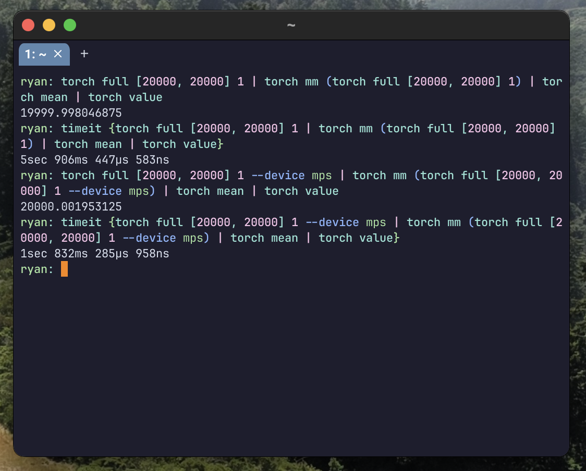

# Nutorch

Nutorch is a [Nushell](https://github.com/nushell/nushell) plugin that wraps
[tch-rs](https://github.com/LaurentMazare/tch-rs), which itself is a wrapper for
libtorch, the C++ backend of [PyTorch](https://pytorch.org/).

In other words, **Nutorch is PyTorch but in Nushell instead of Python**.

## Why?

Because Nushell is a shell, not just a programming language, this makes it
possible to operate on tensors on your GPU directly from the command line,
making Nutorch one of the most convenient ways to do data analysis if you spend
a lot of time in the terminal.

## Demo

Compare CPU and GPU time for a large matrix multiplication on macOS:

```nu
timeit {torch full [20000, 20000] 1 | torch mm (torch full [20000, 20000] 1) | torch mean | torch value}
timeit {torch full [20000, 20000] 1 --device mps | torch mm (torch full [20000, 20000] 1 --device mps) | torch mean | torch value}
```

If you have an NVIDIA GPU, substitute `mps` with `cuda`:

```nu
timeit {torch full [20000, 20000] 1 --device cuda | torch mm (torch full [20000, 20000] 1 --device cuda) | torch mean | torch value}
```



## Garbage Collection

After installing the plugin, you may want to lengthen the garbage collection
interval in your nushell settings:

```nu
$env.config.plugin_gc = {
  plugins: {
    nutorch: {
      stop_after: 10min
    }
  }
}
```

## TODO

- [x] manual_seed
- [x] linspace
- [x] randn
- [x] mm
- [x] full
- [x] tensor
- [x] mul
- [x] add
- [x] sub
- [x] div
- [x] neg
- [x] gather
- [x] squeeze
- [x] unsqueeze
- [x] detach
- [x] arange
- [x] stack
- [ ] repeat
- [ ] repeat_interleave
- [ ] torch... everything else
- [x] add autograd setting to torch.tensor
- [x] add autograd setting to torch.randn
- [x] add autograd setting to torch.full
- [x] add autograd setting to torch.mm
- [x] add autograd setting to torch.linspace

## License

This project is licensed under the MIT License. See the [LICENSE](LICENSE) file
for details.
